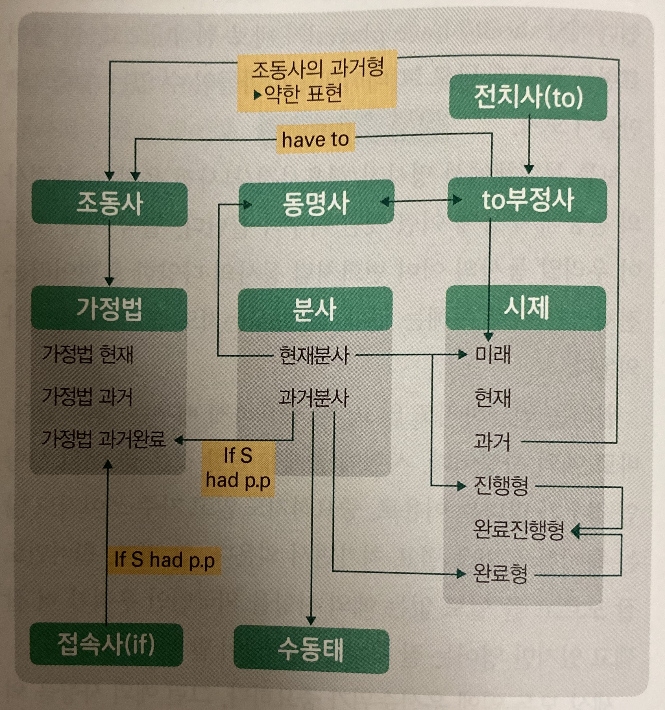

# About English

## 영어의 원리

### 1. 영어는 중요한 것이 먼저 나온다

**주어 + 동사**

영어는 중요한 것이 먼저 나오므로 주어가 나오고, 그 다음에 결론이 되는 동사가 바로 나온다.

**이름**

이름의 경우에도 나의 가족을 나타내는 family name인 성보다 내 이름이 먼저 나온다.

- 정원희 -> Wonhee Jeong

**주소와 날짜**

주소와 날짜를 표현할 때도 배경이 나중에 나온다.

- 대한민국 서울시 종로구 효자동 150 -> 150 Hyoja-dong, Jongno-gu, Seoul, Republic of Korea
- 1983/4/2 -> 2/4/1983 (영국은 4/2/1983)

영어에 담긴 영미권 사람들의 사고방식을 제대로 이해하고 체화해야 한다. 영어를 해석할 때 거꾸로 해석하지 말고 듣는 순서대로 해석하며 따라가고, 말을 할 때 결론을 먼저 내뱉어야 한다.

### 2. 영어는 순서가 중요하다

**조사**

영어에는 조사가 없다. 조사가 없으므로 각 단어가 어떤 품사를 가지는지가 위치에 따라 정해진다. 그렇기 때문에 순서가 중요하다.

**격 변화**

우리말은 조사가 있기 때문에 단어 자체에 격 변화가 없다. '그가', '그를'와 같이 주어에는 주격 조사, 목적어에는 목적격 조사를 붙이면 된다. 그러나 영어에는 조사가 없기 때문에 'he(그는)', 'his(그의)', 'him(그를)'과 같이 단어 자체를 격에 따라 변화시켜줘야 한다.

**전치사**

우리말에 없는 품사가 바로 전치사다. 명사 앞에 위치한다. 관계를 나타내주기 때문에 뒤에 오는 명사보다도 중요하여 명사보다 앞에 온다. 전치사를 쓸 때에는 보통 장소-방법-시간 순으로 사용하지만 내 입장에서 더 중요하다고 생각하는 것을 앞에 배치하여도 무방하다.

- I went (to Busan) (by train) (last week).

### 3. 영어는 원리/원칙을 지키는 언어다

**대명사**

영어는 순서를 잘지켜야 하기 때문에 무언가를 생략하는 경우가 드물다. 그러다보니 주어가 반복해서 등장하는 경우가 많고 이때 대명사를 사용한다.

**가주어**

영어는 결론을 바로 내뱉어야 하는데 주어가 너무 길어지면 결론이 늦게 나온다. 그래서 주어가 긴 경우에는 주어 대신 가주어를 두고 주어를 뒤로 뺀다.

**수동태**

주어를 모르거나 굳이 말해줄 필요가 없을 때 주어를 생략할 수는 없으니 목적어를 주어로 두는 방식의 수동태를 사용한다.

**분사 구문**

영어에서 생략을 할 때는 분사 구문을 사용한다. 주어가 같을 때 주어 하나를 생략하는 것, 접속사가 뻔할 때 굳이 언급하지 않고 간단하게 형태만 바꿔서 말한다.

### 4. 영어에는 개인주의가 묻어 있다

**부정의문문**

영어에서는 자기 자신이 중심이므로 다른 사람이 어떻게 질문했든 내 입장에서 대답하면 된다.

- Q: Don't you like English?
- A: Yes, I like English. (네, 저 영어 좋아해요.)
- A: No, I don't like English. (아니요, 저 영어 싫어해요.) -> Yes, I don't like English. (네, 저 영어 싫어해요.)라고 하지 않는다.

### 5. 영어에서는 모든 것이 별개다

**복수**

영어식 사고방식에서 모든 사물은 배경과 분리된 주체다. 그러다보니 자연스럽게 사물의 수 개념이 발달했다. 단수는 단수, 복수는 복수로 명확하게 표현한다. 명사의 수에 맞춰 앞에 있는 관사, 뒤에 오는 동사까지 전부 수를 일치시켜 표시한다.

**관사**

어떤 사물에 대해 화자와 청자 모두가 알고 있다면 the를 붙인다. 정해져있기 때문에 '정관사'라고 부른다. 정해지지 않은 아무 책 한 권이라면 명사의 수에 맞춰 a/an를 붙인다. 정해지지 않았기 때문에 '부정관사'라고 부른다.

### 6. 영어에서는 동사가 핵심이다

가다에 대해 간다, 갔다, 갈 것이다, 가, 가요 등과 같이 동사의 어미 변화를 통해 미묘한 표현을 하는 것처럼 영어도 동사를 변형하여 말의 뉘앙스를 구분한다.

| 우리말                | 앞 첨가     | 동사 | 뒤 첨가 | 관련 문법       |
| --------------------- | ----------- | ---- | ------- | --------------- |
| 논다                  |             | play | (-s)    | 현재시제        |
| 놀았다                |             | play | -ed     | 과거시제        |
| 놀고 있는 (것)        |             | play | -ing    | 현재분사/동명사 |
| 놀았던 / (놀림) 당한  |             | play | -ed     | 과거분사        |
| 노는 것 / 놀기 위한   | to          | play |         | to 부정사       |
| 놀고 있다             | be          | play | -ing    | 현재진행형      |
| 놀 것이다             | will        | play |         | 미래시제        |
| 놀 예정이다           | be going to | play |         | 미래시제        |
| 놀아왔다              | have        | play | -ed     | 현재완료형      |
| 놀았었다              | had         | play | -ed     | 과거완료형      |
| (놀림) 당하다, 낚이다 | be          | play | -ed     | 수동태          |
| 놀 수 있다            | can         | play |         | 조동사          |
| 놀아도 된다           | may         | play |         | 조동사          |
| 놀아야 한다           | must        | play |         | 조동사          |
| 놀 것이다             | would       | play |         | 조동사          |
| 놀 수 있을 것이다     | could       | play |         | 조동사          |
| 노는 것이 좋겠다      | should      | play |         | 조동사          |
| 놀았을 것이다         | would have  | play | -ed     | 조동사, 가정법  |
| 놀았어야 했다         | should have | play | -ed     | 조동사, 가정법  |
| 놀았을 수도 있다      | could have  | play | -ed     | 조동사, 가정법  |

### 7. 문법은 하나를 알면 열을 안다

**분사**

분사는 나눌 분 자를 쓴다. '동사'에서 분리되어 나왔다는 뜻이다. 원래 동사인 것을 형용사로 쓸 수 있게 변형한 것이다.

**현재분사**

영어에서 동사는 일반적으로 '~하다'라는 뜻이다. 이를 형용사로 바꾼 것이니 '~하는'이라는 뜻이 된다. '~하는'에는 어떤 행동을 당하는 것이 아니라 스스로 한다는 '능동'의 의미와 '진행'의 의미가 있다. 이게 바로 현재분사의 기본 뜻이다.

**현재진행형**

현재분사는 다른 형용사처럼 be 동사 뒤에 쓸 수 있다. be동사는 ~'이다'라는 상태를 나타내므로 'be동사 + 현재분사'는 '~하는 상태이다'라는 뜻이다. 즉 '~하는 중이다'라는 '진행'의 의미가 된다. 이게 현재진행형이다.

**과거분사**

과거분사는 이름 그대로 과거를 의미하기도 하고 수동의 의미도 갖는다. '완료'와 '수동', 이 두 가지 의미를 동시에 갖는 이유는 수동이란 말 자체가 뭔가를 '당했다'는 뜻으로 이미 완료된 과거이기 때문이다. 우리말로 표현하면 주로 '~된'이라는 뜻이 된다.

**수동태**

'be동사 + 과거분사'는 '~된 상태이다', '~를 당한 상태이다'라는 뜻이 된다. 수동의 의미를 갖는 형태라는 뜻으로 '수동태'라는 이름이 붙었다. 'be동사 + 형용사' 구조의 2형식 문장이다.

**완료시제**

have는 '가지다'라는 의미다. 'have + 과거분사'는 과거분사를 '가지다'는 뜻이니까, 과거에 뭔가를 완료한 그 상태를 '아직도 가지고 있다'는 뜻이 된다. 즉 과거의 일을 아직까지도 하고 있는 상태이다.

**완료진행형**

'have + 과거분사 + 진행형'이다. 과거의 상태(과거분사)를 가지도 가지고 있는데(have) 그것이 바로 지금도 진행 중(진행형)이란 소리다.

**미래시제 - will**

will 자체가 '의지'라는 뜻을 가진 단어다. 즉 '의지'를 가지고 미래에 무언가를 하겠다는 의미다. 

**미래시제 - be going to**

'be ~ing'는 현재진행형이고 'to'는 앞으로 쭉 뻗은 방향을 나타내니, '~하러 가는 중이다'라는 의미다. 뭔가를 하러 가는 중이라는 말은 그것을 하겠다는 뜻이다. 

**will vs bo going to**

will과 be going to를 엄밀하게 비교하자면, 하러 간다는 뉘앙스에서 be going to는 좀 더 확실하게 예정되어 있는 미래에 많이 쓴다. 반면, 상대적으로 will은 말하는 사람의 즉흥적인 결심이나 '의지'가 포함된 미래에 주로 쓰인다.

**동명사**

말 그대로 동사를 명사로 쓴다는 것이다. '동사 + ing'다. 현재분사와 같은 모양이다. 동명사가 현재분사에서 나왔기 때문이다. 우리말로도 현재분사는 '~하는'이고 동명사는 '~하는 것'이다. 현재분사에서 갈라져 나온 명사로 이해하면 된다.

**to부정사**

동사를 명사로 표현할 수 있는 또 다른 형태다. 동명사는 명사로 쓰임이 딱 정해져 있지만, to부정사는 명사로만 쓰이는 것이 아니라, 형용사, 부사로도 쓰인다. 정해져 있지 않아서 to부정사다.

**동명사 vs to부정사**

그럼 왜 하필 to를 쓰는가? to부정사의 'to'는 전치사 to(~로)와 같은 어원에서 출발했다. to는 미래에 도착할 목적지를 나타내어 '미래'의 의미가 있다. 마찬가지로 'to + 동사'는 '~하는 것, ~할 것'이라는 뜻이다. 미래의 의미를 가진 전치사 to가 쓰여, 미래에 할 일을 나타내는 표현이 되는 것이다. 그래서 같은 명사라도 미래의 일에는 to부정사를 쓰고 과거의 일이나 진행 중인 일에는 동명사를 쓰는 것으로 용법이 나뉜다.

예를 들어, 편지를 쓰려고 했는데 그걸 잊어버렸다면 미래에 하기로 한 일을 까먹은 것이기에 'forget to write'라고 표현한다. 반면 편지를 과거에 썼던 사실을 잊어버렸다면 'forget writing'이 된다.

**have to**

가지고 있다는 뜻의 have와 미래를 나타내는 to부정사로 이해하면 된다. '미래에 무언가 할 것을 가지고 있다'는 뜻이다.

**조동사**

'조'는 한자로 도울 조다. 기존의 동사를 도와준다는 뜻이다. 조동사 will, may, can 등을 통해 '갈 것이다', '가도 된다', '갈 수 있다' 등 다양하고 섬세한 표현을 할 수 있다.

**조동사의 과거형**

will, whall, can, may는 원형, would, should, could, might가 바로 조동사 과거형이다. 조동사의 과거형은 과거의 의미보다는 추측의 의미, 즉 약한 표현으로 쓰일 때가 더 많다.

- (현재형) 너랑 영화보러 가려고 vs (과거형) 너랑 영화 보러 가려고 했지: 전자는 굉장히 직접적인 표현이다. 후자는 과거에 그렇게 생각했는데 지금은 잘 모르겠다는 느낌이다. 말하는 사람의 확신이 '약하게' 줄어든 표현이다. 이렇게 약하게 표현하는 것은 한편으로 공손한 느낌을 준다.
- Get me some water vs Could you get me some water?: 전자는 직접적으로 명령하는 문장이다. 하지만 후자는 주저하면서 말하는 약한 표현이다. 상대방을 배려하여 조심스럽게 말하는 느낌을 준다.

그러므로 조동사 과거형은 약한 표현, 곧 공손한 표현이 된다.

**가정법**

조동사의 과거형이 약한 표현, 추측을 나타낸다고 했는데, 이걸 if절과 함께 사용하여 '~하면(가정), ~할 것이다(약한 추측)'라는 의미를 나타낸 것뿐이다. 가정하는 것 자체가 추측이자 확신이 덜 찬 '약한 표현'이기 때문이다. 그래서 가정법을 보면 조동사가 필연적으로 들어가 있다. 동사가 과거시제면 가정법 과거라 부르고 과거완료 시제면 가정법 과거완료라 부르는 것 뿐이다.

### 8. 원리만 알면 무한정 긴 영어 문장을 만들 수 있다

우리가 배우는 영문법의 절반 이상은 동사의 변화다. 동사 표현을 통해 문장의 섬세하고 미묘한 차이를 이해핬다면 문장의 길이를 늘려볼 수 있다.

|      | 전치사구 | 준동사구 | 관계사절 |
| ---- | -------- | -------- | -------- |
| 주어 | X        | X        | O        |
| 동사 | X        | O        | O        |

**전치사구**

전치사구란, '전치사 + 명사'로 이루어져 형용사, 부사 역할을 하는 수식어구이다. 하나의 품사가 아니라 '전치사 + 명사'로 이루어진 '구'이기 때문에 문장에 전치사구가 하나만 들어가도 단어가 두 개 이상 늘어난다. 이런 전치사구를 문장 뒤에 몇 개라도 붙여 쓸 수 있으니 문장 길이가 길어질 수밖에 없다.

**준동사**

동사에 준하는 표현이라는 뜻으로 앞에서 배운 분사, 동명사, to부정사를 말한다. 모두 동사를 기반으로 다른 품사 역할을 한다는 공통점이 있다. 분사는 형용사 역할, 동명사는 이름 그대로 명사 역할을 한다. to부정사는 동사를 명사, 형용사, 부사로 다양하게 활용한다. 준동사는 동사가 아니지만, 동사처럼 목적어나 보어를 가질 수 있기 때문에 준동사가 쓰인 문장 역시 길이가 길어질 수밖에 없다.

**관계사절**

관계대명사, 관계부사로 연결된 문장이다. 다른 말로 형용사절이라고 한다. 말 그대로 명사를 수식하는 '절'이라는 뜻이다. 절에는 주어와 동사가 모두 있기 때문에 문장의 길이가 당연히 길어진다.

## 8품사

1. 명사: 이름을 나타내는 말 (이름, 명칭 / ~함, ~다움)
2. 감탄사: 순간적인 감정을 표현하는 말
3. 접속사: 단어, 구, 절, 문장을 서로 이어주는 말
4. 전치사: 명사와 함께 다른 말을 꾸며주는 말
5. 대명사: 명사를 대신하는 말 (나, 너, 우리 ... / 이것, 저것, 그것)
6. 동사: 움직임을 나타내는 말 (~하다, ~이다)
7. 형용사: 명사를 꾸며주는 말 (~한, ~스러운)
8. 부사: 동사, 형용사, 다른 부사를 꾸며주는 말 (~하게, ~스럽게)

## 문장의 구성 단위

- 단어: 의미를 가진 문장의 최소 구성 단위. 문장에서 띄어쓰기로 구분되는 말이다. 모든 단어는 뜻과 품사를 가진다.
- 구: 여러 개의 단어로 이루어진 문장 구성 단위. 두 개 이상의 단어가 하나의 품사처럼 쓰이는 것을 말한다.
- 절: 주어와 동사가 있는 문장 구성 단위. '주어+'동사'를 갖추고 있으면서 문장의 구성 성분으로 쓰이는 것을 말한다. 종속절은 접속사로 주절에 연결된다.

## 문장의 성분

- 주어: 동사의 주체. 동사의 주체가 되는 사람이나 사물 등을 말한다.
  - 주어가 될 수 있는 어구: (대)명사, 명사구, 명사절
  - [All students] must take the final exam.
- 동사: 주어의 동작이나 상태를 나타내는 말. 주어의 행위, 동작, 상태 등을 나타내는 동사를 말한다. 동사는 반드시 시제를 가진다.
  - 동사가 될 수 있는 어구: 동사, 조동사+동사
  - We [studied] together in high school.
- 목적어: 동사의 대상. 동사의 행위나 동작을 당하거나 받는 대상을 가리킨다.
  - 직접목적어: 동작을 받는 대상
  - 간접목적어: 동작이 향하는 사람[사물]
  - 목적어가 될 수 있는 어구: (대)명사, 명사구, 명사절
  - He handed [me][간접목적어] [a beautiful portrait][직접목적어].
- 보어: 문장의 불완전한 의미를 보충하는 말. 주어, 동사, 목적어만으로 문장의 의미가 완결되지 않을 때, 뜻을 보충하는 말이다.
  - 주격보어: 주어의 의미를 보충해주는 말
  - 목적격보어: 목적어의 의미를 보충해주는 말
  - 보어가 될 수 있는 어구: (대)명사, 명사구, 명사절, 형용사, 형용사구, 전치사구
  - John is [an English teacher].
- 수식어: 다른 문장 성분을 꾸며주는 말. 다른 단어, 구, 절을 수식하는 말로 문장에서 필수가 아닌 보조적인 역할을 한다.
  - 수식어가 될 수 있는 어구 1) 형용사 역할: 형용사, 형용사구, 형용사절(관계사절), to부정사구, 분사구, 전치사구 2) 부사 역할: 부사, 부사구, 부사절, to부정사구, 분사구문, 전치사구
  - We ate our lunch [quickly].
